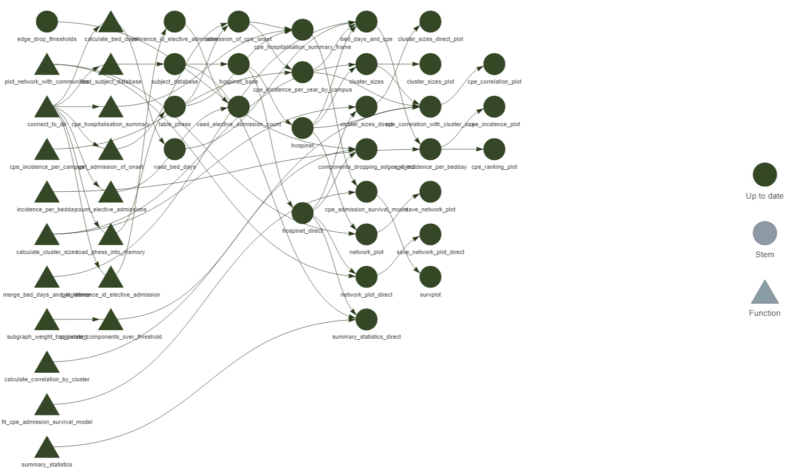

# Targets, the make-like pipeline {#targets}

```{r clean-targets}
tar_invalidate(matches("*"))
```

The project structure we discussed in Chapter \@ref(rstudio) works fine for our
reasonably straightforward projects that don't have too many moving parts.

Often, our analyses will take a long time to run (I'm looking at you Stan) or
are stochastic (again, Stan), and so we don't want to re-run them every time we
run our pipeline script. But, we need to make sure everything is up to date if
we change something.

For example, I've plotted my model fit, but mislabelled my axes. I want to
re-run the plot but not every step of my analysis. How can I make sure
everything is up to date?

### Exercise

How would you go about keeping only the relevant parts of your script up to
date?

## Enter `targets`

Targets borrows it's workflow pattern from very old tools like `Make`, to only
run the parts of an analysis that *actually* need updating.

It uses *dynamic programming* to look at the set of outputs (known as "targets")
and determine if they are outdated, and thus only runs the part of the analysis
that needs to be re-run.

First, let's install targets:

``` {r, eval=F, echo=T}
install.packages("targets")
install.packages("visNetwork")
library(targets)
```

Annoyingly, targets relies on `igraph` to do a lot of it's graph-related work
both to visualise the pipeline and work out what is connected to what. `igraph`
is a very large, very heavy package so give it a few minutes to install. We also
install `visNetwork` as that will give us some pretty visualisations shortly.

Every `targets` workflow needs a special `_targets.R` file. We can create that
by running:

``` {r, eval=F, echo=T}
targets::use_targets()
targets::tar_edit()
```

and actually, we can use that second command to edit the this file from
anywhere, so it can be useful to bind it to a key.

## Targets script file

After creating, your `_targets.R` file will look something like this:
```{r, eval=F, echo=T}
# Created by use_targets().
# Follow the comments below to fill in this target script.
# Then follow the manual to check and run the pipeline:
#   https://books.ropensci.org/targets/walkthrough.html#inspect-the-pipeline # nolint

# Load packages required to define the pipeline:
library(targets)
# library(tarchetypes) # Load other packages as needed. # nolint

# Set target options:
tar_option_set(
  packages = c("tibble"), # packages that your targets need to run
  format = "rds" # default storage format
  # Set other options as needed.
)

# tar_make_clustermq() configuration (okay to leave alone):
options(clustermq.scheduler = "multicore")

# tar_make_future() configuration (okay to leave alone):
# Install packages {{future}}, {{future.callr}}, and {{future.batchtools}} to allow use_targets() to configure tar_make_future() options.

# Load the R scripts with your custom functions:
for (file in list.files("R", full.names = TRUE)) source(file)
# source("other_functions.R") # Source other scripts as needed. # nolint

# Replace the target list below with your own:
list(
  tar_target(
    name = data,
    command = tibble(x = rnorm(100), y = rnorm(100))
#   format = "feather" # efficient storage of large data frames # nolint
  ),
  tar_target(
    name = model,
    command = coefficients(lm(y ~ x, data = data))
  )
)
```
There's a bit going on here. The first point of difference from a typical
workflow is that instead of loading packages with `library`, we set them inside
`tar_option_set`.

This is because `targets` runs in a fresh R session (not your current one!) and
will load those packages into each session separately.

The next few lines are focussed on running `targets` in parallel - helpful but
outside the scope for today.

Then, there is a one-liner that will source all the files in your "R"
subdirectory.

Finally, there's a list of targets, and this is the juicy part...

## Defining a target

All targets must start with a call to `tar_target()`. This function takes two
arguments:

1.  A name for the target (call it whatever you like, but make it memorable)
2.  A command to run. This can be any valid R expression, but the `targets`
    authors suggest following *functional programming*. More on this a bit
    later.

The example file has two targets. One generates some data, and the second fits a
linear model to said data.

We can see how this works by calling:

``` {r, echo=T}
tar_visnetwork()
```

We can see our 2 functions, and the object `file`, which is produced by the code
which will source our R files. The graph shows us that data feeds into the
model.

## Running a pipeline

Running the targets pipeline is straightforward^[one shouldn't call
`tar_make()` inside an Rmd document, as it will get called every time you knit,
which isn't really ideal.]


``` {r, echo=T}
tar_make()
```

There's a bit of output telling you what gets built and what gets skipped. The
first time you run a pipeline, everything will have to be made, but from then
on, only the outdated bits will be run:

``` {r, echo=T}
tar_make()
```

## Working with a target

Once your targets are built, you might want to do something with them. For
interactive programming (which includes markdown), we can load the target into
our current environment using `tar_load()`. For example,

``` {r, echo=T}
tar_load(model)
model
```

We can also just print the current value (useful for plots) with `tar_read()`.

Note that you only need to `tar_load` or `tar_read` *outside* of the targets
workflow. If you're writing a function to use an input, *do not* use these
functions, just use the input argument as you normally would, and pass in the
name of the target inside the `_targets.R` file. For example, if we wanted a
function that worked with our coefficients we would write:

``` {r, echo=T, eval=F}
transform_slope <- function(coefficients, multiplier) {
  coefficients[2] * multiplier # Note the lack of tar_load() here!
}
```

and then add the following to the end of the `_targets.R` file:

``` {r, eval=F, echo=T}
tar_target(
  transformed_slope,
  transform_slope(model, 3)
)
```

### Exercise

Try adding these features to your targets pipeline and get it to run.

## Function-oriented programming

Technically speaking, `tar_target` will accept any valid R expression.
Theoretically, this means we never need to write another R function ever again!

But, if we do that, we'll quickly find our `_targets.R` file will be incredibly
long. Consider this example from the `targets` manual:

```{r, eval=F, echo=T}
library(targets)
source("R/functions.R")
tar_option_set(packages = c("tibble", "readr", "dplyr", "ggplot2"))
list(
  tar_target(file, "data.csv", format = "file"),
  tar_target(
    data,
    read_csv(file, col_types = cols()) %>%
      filter(!is.na(Ozone))
  ),
  tar_target(
    model,
    lm(Ozone ~ Temp, data) %>%
      coefficients()
  ),
  tar_target(
    plot,
    ggplot(data) +
      geom_point(aes(x = Temp, y = Ozone)) +
      geom_abline(intercept = model[1], slope = model[2]) +
      theme_gray(24)
  )
)
```

With only three, relatively simple targets, this file is already 18 lines long.
If we instead write each of these targets as their own functions, we can reduce
this file to

``` {r, echo=T, eval=F}
library(targets)
source("R/functions.R")
tar_option_set(packages = c("tibble", "readr", "dplyr", "ggplot2"))
list(
  tar_target(file, "data.csv", format = "file"),
  tar_target(data, get_data(file)),
  tar_target(model, fit_model(data)),
  tar_target(plot, plot_model(model, data))
)
```

Much cleaner.

This makes us write a function for every step in our process, which makes
long-term maintenance of code a lot easier. It might seem cludgy at first (it
was to me), but over time it has led my code to be cleaner and easier to adjust
going forward. I also recommend the rather nice `fnmate` package (only available
on GitHub) to make writing functions easier as it will auto-generate the
skeletons for you.

## `targets` helps you manage complicated workflows

Here is a more complicated workflow from one of my projects:



You can see how if I update a function somewhere in the middle, it's not
immediately obvious to me what needs to be updated and when, yet targets will
handle all of this for me. Truly one of my favourite packages.

## Extra reading

The [user manual](https://books.ropensci.org/targets/) for `targets` is quite
good.

`tarchetypes` is another good package that makes `targets` [a bit
nicer](https://github.com/ropensci/tarchetypes) to work with.