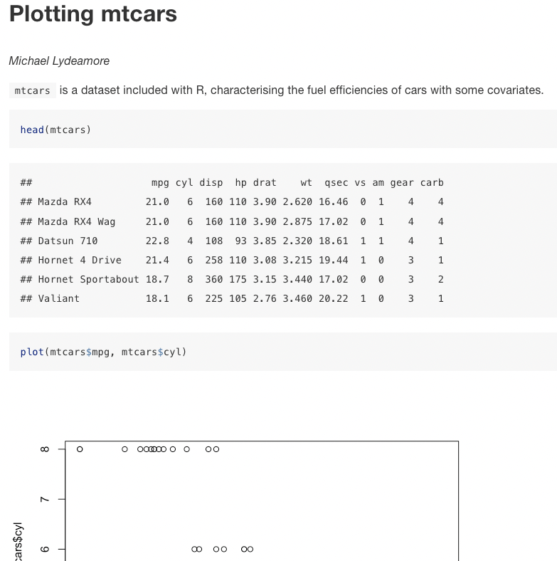

# RMarkdown basics {#rmarkdown}

Here, we will:

  - Learn what an RMarkdown document is
  - Write some markdown and combine it with R code
  - Compile to HTML, PDF and Word

## What is RMarkdown?

To understand the purpose pf RMarkdown, we should first take a look at the
"traditional" scientific writing process.

## The traditional writing process

Usually, you will load the data, write the scripts to do the analysis, save some
figures, and get to writing. If you're a mathematician or computer scientist,
you'll write in LaTeX, if you're not you'll probably use Word.

When you write out your tables, if you're like me, you'll painstakingly
copy/paste numbers from the console into the document, and hope you get the row
right.

Then, when your work is done, and the reviews come back, they've asked you to
add a term to the model. No problem, you say. You add your model term, update
the tables, resubmit, ba da bing, ba da boom.

Except you forgot the figure!

Sigh.

## Enter RMarkdown

Markdown is a basic "markup" language. You write plain text, and a compiler will
convert it into HTML for display.

RMarkdown combines R with markdown, and allows you to embed code into your
writing. It's the future!

Now, you can write your paper and include the code to make the figures or the
models, and then when Reviewer 2 comes and asks for an extra term, nothing will
be forgotten.

RMarkdown could be considered *literate programming*. That is, the combination
of literature and programming, a concept first introduced by [Donald
Knuth](https://en.wikipedia.org/wiki/Donald_Knuth).

RMarkdown documents can be compiled into HTML, PDF or Word documents. I
recommend working with HTML for now, spending time messing about with Word and
PDF formatting tends to be wasted time unless the document is almost final.

We'll spend a lot more time today about RMarkdown, but for now, let's compile a
little document of our own.


    ---
    title: "Plotting mtcars"
    author: "Michael Lydeamore"
    output: html_document
    ---
    `mtcars` is a dataset included with R, characterising the fuel efficiencies of cars with some covariates.
    
    ```{r, echo=T, eval=F}
    head(mtcars)
    plot(mtcars$mpg, mtcars$cyl)
    ```

This should produce a small report that looks something like this:



## Exercise

Copy the above RMarkdown code into a blank document, and "Knit" to HTML, PDF and
Word.

If you get an error compiling to PDF, you might have to install the `tinytex`
package.